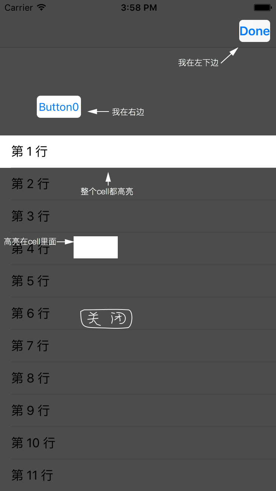

# ZTFeatureView

> 可以方便地为界面添加新特性指引图

##使用方法

* 添加文件`ZTFeatureMaskView.h`与`ZTFeatureMaskView.m`至工程中。
* 导入头文件： 
 
		#import "ZTFeatureMaskView.h"
		
* 创建并显示ZTFeatureMaskView:

		- (void)showFeatures
		{
		    /** 使用APP版本作为oneTimeKey,则当前版本下指引图只会显示一次 */
		    NSString *oneTimeKey = [[NSBundle mainBundle] objectForInfoDictionaryKey:@"CFBundleShortVersionString"];
		    ZTFeatureMaskView *featureView = [[ZTFeatureMaskView alloc] initWithOneTimeKey:oneTimeKey];
		    [featureView setMaskedView:[[UIApplication sharedApplication] keyWindow]];
	    
		    /* 给 button 添加新特性指引 */
		    [featureView addTransparencyInReferenceView:self.button radius:5.0];
		    [featureView addImage:[UIImage imageNamed:@"feature0"] referenceView:self.button withOuterSpacingRight:5.0f spacingBottom:-self.button.frame.size.height / 2];
	    
		    /* 给 rightBarButtonItem 添加新特性指引 */
		    UIView *rightItemView = nil;
		    if ([self.navigationItem.rightBarButtonItem respondsToSelector:@selector(view)]) {
		        rightItemView = (UIView *)[self.navigationItem.rightBarButtonItem performSelector:@selector(view)];
		    }
	    
		    if (rightItemView) {
		        [featureView addTransparencyInReferenceView:rightItemView radius:5.0f];
		        [featureView addImage:[UIImage imageNamed:@"feature1"] referenceView:rightItemView withOuterSpacingLeft:0.0f spacingBottom:5.0f];
		    }
		    
		    /* 给 整个 Cell 高亮 */
		    UITableViewCell *cell0 = [self.tableView cellForRowAtIndexPath:[NSIndexPath indexPathForRow:0 inSection:0]];
		    if (cell0) {
		        [featureView addTransparencyInReferenceView:cell0];
		        [featureView addImage:[UIImage imageNamed:@"feature3"] referenceView:cell0 withOuterSpacingLeft:-cell0.frame.size.width / 2 spacingBottom:5.0f];
		    }
		    
		    /* 在 Cell 内部高亮 */
		    UITableViewCell *cell1 = [self.tableView cellForRowAtIndexPath:[NSIndexPath indexPathForRow:3 inSection:0]];
		    if (cell1) {
		        [featureView addTransparencyInReferenceView:cell1 innerRect:CGRectMake(100.0f, 5.0f, 60.0f, 30.0f)];
		        [featureView addImage:[UIImage imageNamed:@"feature2"] referenceView:cell1 withInnerSpacingLeft:5.0f spacingTop:5.0f];
		    }
		    
		    /** 添加关闭按钮 */
		    [featureView addCloseButtonWithImage:[UIImage imageNamed:@"feature4"] referenceView:cell1 withInnerSpacingLeft:100.0f spacingTop:100.0f];
		    
		    [featureView show];
		}